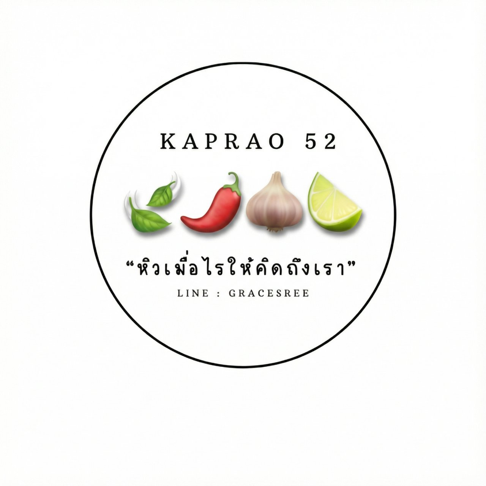
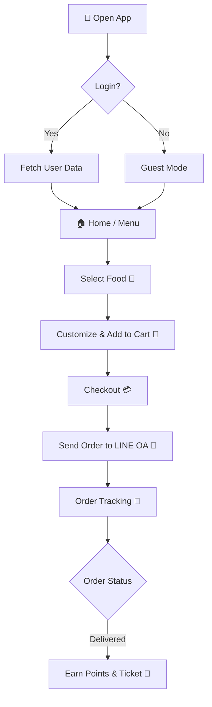
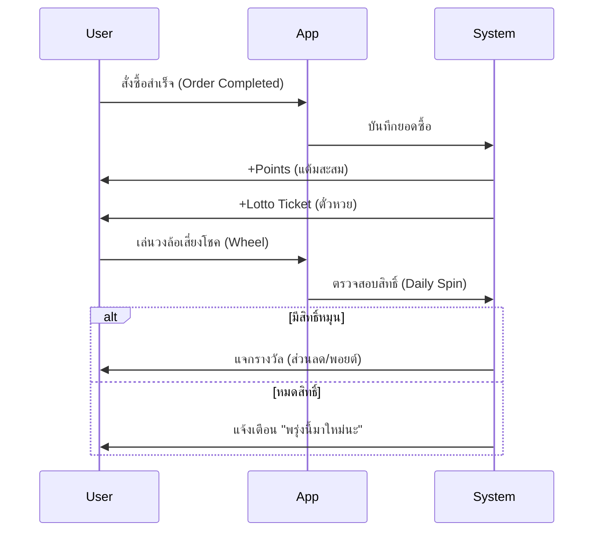

# 🍛 Kaprao52 (กะเพรา 52)

> **สุดยอดแอพสั่งอาหารสตรีทฟู้ด** ที่มาพร้อมกับความทันสมัย กราฟิกจัดเต็ม และระบบสมาชิกสุดล้ำ!



## 📱 เกี่ยวกับโปรเจกต์ (About)
**Kaprao52** คือเว็บแอพพลิเคชันสำหรับสั่งอาหาร (Web App) ที่เน้นประสบการณ์การใช้งานที่สนุกและตื่นเต้น (Gamification) ออกแบบมาเพื่อร้านอาหารตามสั่งยุคใหม่ โดยเฉพาะเมนู "กะเพรา" ที่เป็นเมนูยอดฮิต

แอพนี้ไม่ได้มีแค่หน้าสั่งอาหารธรรมดา แต่ยังมีระบบ **สุ่มอาหาร**, **วงล้อเสี่ยงโชค**, **สะสมแต้ม**, และ **ลุ้นหวยจากเลข Order ID** เพื่อให้ลูกค้ากลับมาใช้งานซ้ำ!

---

## ✨ ฟีเจอร์เด่น (Key Features)

### 🛍️ ระบบสั่งอาหาร (Ordering System)
- **Smart Menu**: เมนูแยกหมวดหมู่ชัดเจน (กะเพรา, ของทอด, เส้น, แกง)
- **Customization**: เลือกระดับความเผ็ด, เนื้อสัตว์, และท็อปปิ้ง (ไข่ดาว, ไข่เจียว, ไข่เยี่ยวม้า) ได้อย่างละเอียด
- **Cart & Checkout**: ตะกร้าสินค้าและระบบคิดเงินที่คำนวณส่วนลดและพอยต์อัตโนมัติ

### 🛵 ติดตามสถานะ (Order Tracking)
- **Real-time Status**: แสดงสถานะตั้งแต่ 📝 รับออเดอร์ -> 🔥 กำลังปรุง -> 🛵 กำลังส่ง -> ✅ ถึงแล้ว
- **Visual Timeline**: ไทม์ไลน์สวยงาม เข้าใจง่าย

### 👨‍🍳 โหมดเจ้าของร้าน (Admin Mode)
- **Secure Access**: เข้าใช้งานผ่านเมนู "เพิ่มเติม" -> "โหมดเจ้าของร้าน" (รหัสผ่าน: `5252`)
- **Order Management**: อัพเดทสถานะออเดอร์ได้ทันที (เช่น กดเปลี่ยนจาก "กำลังปรุง" เป็น "กำลังส่ง")
- **Google Sheets Sync**: รองรับการดึงข้อมูลออเดอร์จาก Google Sheets (Backend)

### 🎰 เกมและสิทธิพิเศษ (Gamification & Loyalty)
- **Kaprao Points**: ทุกการสั่งซื้อได้รับพอยต์ สะสมเพื่อแลกส่วนลด
- **Wheel of Fortune**: วงล้อเสี่ยงโชค ลุ้นรางวัลพิเศษ
- **Lotto Ticket**: เลขท้าย Order ID ลุ้นหวยรัฐบาล งวดวันที่ 1 และ 16
- **Randomizer**: "คิดไม่ออก?" ให้ระบบสุ่มเมนูให้!

### 💬 การเชื่อมต่อ (Integration)
- **LINE LIFF Support**: รองรับการทำเป็น LINE Mini App ดึงรูปโปรไฟล์และชื่อจาก LINE ได้ทันที

---

## �️ การทำงานของระบบ (System Workflow)

### 1. User Journey (เส้นทางผู้ใช้งาน)


### 2. Gamification Loop (ระบบเล่นเกมสะสมแต้ม)


---


## �🛠️ เทคโนโลยี (Tech Stack)

- **Frontend**: HTML5, CSS3 (Modern CSS Variables, Animations), JavaScript (Vanilla ES6+)
- **Styling**: Creative CSS Design System (Glassmorphism, Neon Effects)
- **Backend (Mockup/Connectable)**: Google Sheets API (Script App) integration ready.
- **Iconography**: FontAwesome

---

## 🚀 วิธีเริ่มต้นใช้งาน (Getting Started)

### 1. การติดตั้งและรัน (Installation)

โปรเจกต์นี้เป็น Static Web App สามารถรันได้ทันทีโดยไม่ต้องตั้งค่า Server ซับซ้อน

```bash
# Clone โปรเจกต์
git clone https://github.com/Sorawittj/Kaprao-app.git

# เข้าไปที่โฟลเดอร์
cd Kaprao-app

# ติดตั้ง Dependencies (สำหรับ Development Tools เท่านั้น)
npm install

# รัน Server จำลอง
npm run dev
# หรือ
npx serve
```

### 2. การใช้งานโหมดเจ้าของร้าน (Admin Access)
1. ไปที่เมนู **"เพิ่มเติม" (More)** ที่แถบด้านล่าง
2. กดปุ่ม **"โหมดเจ้าของร้าน" (Shop Owner Mode)**
3. กรอกรหัสผ่าน: **`5252`**
4. จะเข้าสู่หน้า **Order Tracking** ที่มีปุ่มควบคุมสถานะสินค้าเพิ่มขึ้นมา

---

## 📂 โครงสร้างไฟล์ (Project Structure)

```
Kaprao-app/
├── constants/       # ค่าคงที่ต่างๆ
├── css/            # ไฟล์ Style (animations.css, cosmic.css)
├── images/         # รูปภาพประกอบ
├── js/
│   ├── app.js           # Logic หลักของแอพ
│   ├── data/menu.js     # ข้อมูลเมนูอาหาร
│   ├── orderTracking.js # ระบบติดตามออเดอร์
│   ├── state.js         # ตัวแปร Global State
│   ├── gamification.js  # ระบบเกม (ล้อหมุน)
│   ├── liff.js          # การเชื่อมต่อ LINE
│   └── ...
├── index.html      # หน้าหลัก
└── sw.js           # Service Worker (PWA offline support)
```

---

## 🔒 Security Note
*Admin Mode ในเวอร์ชันปัจจุบันทำงานแบบ Client-side logic เพื่อการสาธิต (Demo) เท่านั้น สำหรับการใช้งานจริงควรเชื่อมต่อกับระบบ Authentication ฝั่ง Server*

---

**Developed with ❤️ by Sorawittj**
*Version 24.2.0 COSMIC EDITION*
