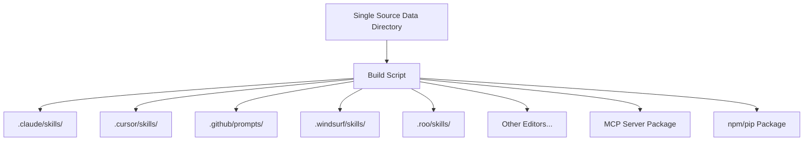
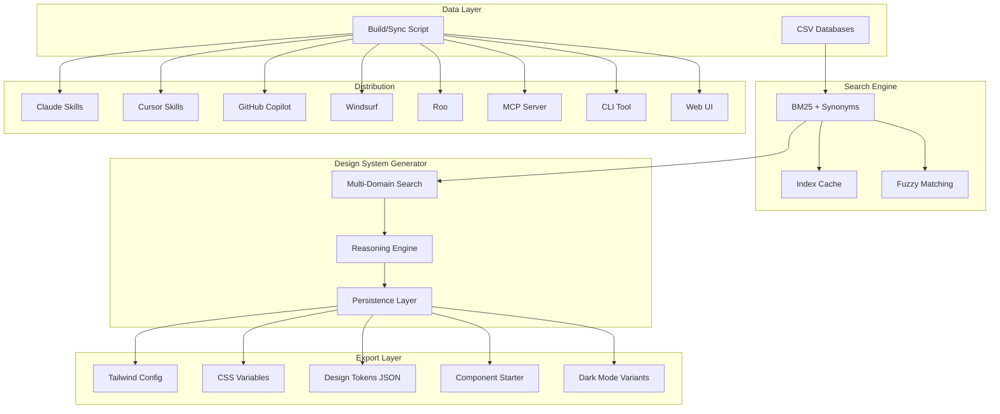

# UI/UX Pro Max — Comprehensive Analysis & World-Class Improvement Plan

## Executive Summary

**UI/UX Pro Max** is an AI-powered design intelligence tool that provides design system recommendations via BM25 search across CSV databases. It supports 13 tech stacks, 67 styles, 96 color palettes, 57 font pairings, and 99 UX guidelines. It's distributed as a skill/prompt across 10+ AI code editors (Claude, Cursor, Windsurf, Roo, GitHub Copilot, etc.).

---

## Current State Analysis

### ✅ Strengths
1. **Rich Data** — Extensive CSV databases covering styles, colors, typography, products, UX, charts, icons, and stacks
2. **BM25 Search** — Solid text search algorithm with auto-domain detection
3. **Design System Generator** — Intelligent multi-domain search with reasoning rules
4. **Master + Overrides Pattern** — Hierarchical persistence for project-specific design systems
5. **Multi-Editor Support** — Distributed across 10+ AI editors (Claude, Cursor, Windsurf, Roo, Copilot, etc.)
6. **Zero Dependencies** — Pure Python, no external packages needed
7. **Intelligent Page Overrides** — Search-based page-specific recommendations

### ⚠️ Gaps & Weaknesses

| Dimension | Issue | Severity |
|-----------|-------|----------|
| **Data Coverage** | No dark mode color palettes (only dark mode style) | HIGH |
| **Data Coverage** | No responsive breakpoint-specific guidelines | MEDIUM |
| **Data Coverage** | No animation/motion library recommendations | MEDIUM |
| **Data Coverage** | No icon search integration (icons.csv exists but not in design system) | MEDIUM |
| **Search Quality** | BM25 doesn't handle synonyms or semantic similarity | HIGH |
| **Search Quality** | No fuzzy matching for typos | MEDIUM |
| **Output** | No Tailwind config generation from design system | HIGH |
| **Output** | No CSS variables file export | HIGH |
| **Output** | No Figma/design token export | MEDIUM |
| **Persistence** | No version history for design systems | MEDIUM |
| **Persistence** | No diff/comparison between design system versions | LOW |
| **Testing** | No test suite for search accuracy or regression | HIGH |
| **Distribution** | Duplicated data across 10+ directories (~500KB × 10 = ~5MB waste) | HIGH |
| **Distribution** | No automated sync mechanism between editor configs | HIGH |
| **Documentation** | No README.md at project root | HIGH |
| **Documentation** | No CHANGELOG or versioning | MEDIUM |
| **Performance** | BM25 index rebuilt on every search (no caching) | MEDIUM |
| **Ecosystem** | No MCP server implementation | HIGH |
| **Ecosystem** | No web UI for browsing/previewing design systems | MEDIUM |
| **Ecosystem** | No CLI installer/updater | MEDIUM |

---

## Improvement Recommendations by Dimension

### 1. 🔍 Search & Intelligence (Priority: CRITICAL)

```
Current: BM25 keyword search → exact token matching
Target:  Hybrid search with synonyms + semantic understanding
```

| # | Improvement | Impact |
|---|-------------|--------|
| 1.1 | **Synonym expansion** — Add synonym mapping (e.g., "modern" → "contemporary, sleek, clean") | HIGH |
| 1.2 | **Fuzzy matching** — Add Levenshtein distance for typo tolerance | MEDIUM |
| 1.3 | **Multi-language query support** — Map Thai/Chinese/Japanese keywords to English | HIGH |
| 1.4 | **Search result scoring explanation** — Show why a result was selected | MEDIUM |
| 1.5 | **Composite queries** — Support "NOT brutalism" or "minimalism AND dark" | MEDIUM |
| 1.6 | **Search caching** — Cache BM25 index per CSV file to avoid rebuilding | MEDIUM |

### 2. 📊 Data & Content (Priority: HIGH)

| # | Improvement | Impact |
|---|-------------|--------|
| 2.1 | **Dark mode color palettes** — Add dedicated dark mode variants for all 96 palettes | HIGH |
| 2.2 | **Responsive design tokens** — Breakpoint-specific spacing, font sizes, layouts | HIGH |
| 2.3 | **Animation library recommendations** — Framer Motion, GSAP, CSS animations per style | MEDIUM |
| 2.4 | **Component patterns** — Add common component patterns (navbar, sidebar, footer, etc.) | HIGH |
| 2.5 | **Accessibility scores** — WCAG compliance rating per style | MEDIUM |
| 2.6 | **Real-world examples** — Add screenshot URLs or reference sites per style | MEDIUM |
| 2.7 | **Micro-interaction patterns** — Button clicks, form validation, loading states | MEDIUM |
| 2.8 | **New product types** — Add AI/ML tools, Developer tools, Marketplace, Subscription box, Podcast, Newsletter | MEDIUM |
| 2.9 | **Seasonal/trend data** — 2024-2025 design trends (Bento grid, AI-native, spatial design) | LOW |
| 2.10 | **Icon integration in design system** — Include icon recommendations from icons.csv | MEDIUM |

### 3. 📤 Output & Export (Priority: HIGH)

| # | Improvement | Impact |
|---|-------------|--------|
| 3.1 | **Tailwind config export** — Generate `tailwind.config.js` from design system | HIGH |
| 3.2 | **CSS variables export** — Generate `:root { --color-primary: ... }` file | HIGH |
| 3.3 | **Design tokens JSON** — Export in Style Dictionary / Figma Tokens format | MEDIUM |
| 3.4 | **Component starter code** — Generate boilerplate for selected stack | HIGH |
| 3.5 | **shadcn/ui theme export** — Generate theme config for shadcn projects | MEDIUM |
| 3.6 | **Storybook config** — Generate Storybook theme from design system | LOW |
| 3.7 | **Dark mode toggle** — Generate both light and dark mode tokens | HIGH |

### 4. 🏗️ Architecture & Distribution (Priority: HIGH)



| # | Improvement | Impact |
|---|-------------|--------|
| 4.1 | **Single source of truth** — Store data/scripts once, use build script to distribute | HIGH |
| 4.2 | **Build/sync script** — Automate copying to all editor directories | HIGH |
| 4.3 | **MCP Server** — Create an MCP server for direct tool integration | HIGH |
| 4.4 | **npm/pip package** — Publish as installable package | MEDIUM |
| 4.5 | **Version management** — Add version.txt and CHANGELOG.md | MEDIUM |
| 4.6 | **GitHub Actions CI** — Auto-validate CSV data, run tests, sync distributions | MEDIUM |

### 5. 🧪 Testing & Quality (Priority: HIGH)

| # | Improvement | Impact |
|---|-------------|--------|
| 5.1 | **Search accuracy tests** — Test that "SaaS" returns SaaS products, not healthcare | HIGH |
| 5.2 | **CSV validation** — Validate all CSVs have required columns, no empty rows | HIGH |
| 5.3 | **Color contrast validation** — Verify all color palettes meet WCAG 4.5:1 | MEDIUM |
| 5.4 | **Google Fonts URL validation** — Verify all font URLs are valid | LOW |
| 5.5 | **Regression tests** — Ensure design system output doesn't change unexpectedly | MEDIUM |
| 5.6 | **Performance benchmarks** — Track search speed as data grows | LOW |

### 6. 🌐 Ecosystem & User Experience (Priority: MEDIUM)

| # | Improvement | Impact |
|---|-------------|--------|
| 6.1 | **Web UI / Preview** — Browser-based design system previewer with live color swatches | HIGH |
| 6.2 | **CLI tool** — `npx ui-ux-pro-max search "SaaS"` or `pip install ui-ux-pro-max` | MEDIUM |
| 6.3 | **VS Code extension** — Sidebar panel for browsing styles and palettes | MEDIUM |
| 6.4 | **Design system comparison** — Compare two design systems side by side | LOW |
| 6.5 | **Community contributions** — Allow users to submit new styles/palettes via PR | MEDIUM |
| 6.6 | **Analytics** — Track which styles/palettes are most popular | LOW |

### 7. 📖 Documentation (Priority: HIGH)

| # | Improvement | Impact |
|---|-------------|--------|
| 7.1 | **Root README.md** — Project overview, installation, quick start | HIGH |
| 7.2 | **Contributing guide** — How to add new styles, palettes, stacks | MEDIUM |
| 7.3 | **API documentation** — Document all Python functions and parameters | MEDIUM |
| 7.4 | **Example gallery** — Showcase generated design systems for different industries | MEDIUM |
| 7.5 | **Video tutorials** — Quick start videos for each supported editor | LOW |

### 8. 🤖 AI-Native Features (Priority: HIGH — Differentiator)

| # | Improvement | Impact |
|---|-------------|--------|
| 8.1 | **Context-aware recommendations** — Read existing project files to suggest matching styles | HIGH |
| 8.2 | **Design system evolution** — Track changes over time, suggest improvements | MEDIUM |
| 8.3 | **A/B test suggestions** — Recommend design variants for conversion testing | MEDIUM |
| 8.4 | **Competitive analysis** — Compare design system against industry benchmarks | MEDIUM |
| 8.5 | **Auto-detect tech stack** — Read package.json/pubspec.yaml to auto-select stack | HIGH |
| 8.6 | **Design review mode** — Analyze existing UI code and suggest improvements | HIGH |

---

## Prioritized Implementation Roadmap

### Phase 1: Foundation — Fix Critical Gaps
- [ ] 4.1 Single source of truth architecture
- [ ] 4.2 Build/sync script for distribution
- [ ] 7.1 Root README.md
- [ ] 5.1 Search accuracy tests
- [ ] 5.2 CSV validation script
- [ ] 3.1 Tailwind config export
- [ ] 3.2 CSS variables export

### Phase 2: Enhanced Intelligence
- [ ] 1.1 Synonym expansion for search
- [ ] 1.2 Fuzzy matching for typos
- [ ] 2.1 Dark mode color palettes
- [ ] 2.4 Component patterns database
- [ ] 3.4 Component starter code generation
- [ ] 3.7 Dark mode toggle support
- [ ] 8.5 Auto-detect tech stack

### Phase 3: Ecosystem Growth
- [ ] 4.3 MCP Server implementation
- [ ] 6.1 Web UI / Preview tool
- [ ] 2.3 Animation library recommendations
- [ ] 2.10 Icon integration in design system
- [ ] 3.3 Design tokens JSON export
- [ ] 4.5 Version management
- [ ] 4.6 GitHub Actions CI

### Phase 4: World-Class Differentiators
- [ ] 8.1 Context-aware recommendations
- [ ] 8.6 Design review mode
- [ ] 1.3 Multi-language query support
- [ ] 6.2 CLI tool (npm/pip)
- [ ] 6.3 VS Code extension
- [ ] 8.3 A/B test suggestions
- [ ] 2.6 Real-world examples with screenshots

---

## Architecture Diagram — Target State



---

## Key Metrics for World-Class Status

| Metric | Current | Target |
|--------|---------|--------|
| Product types covered | ~35 | 60+ |
| Color palettes | 96 | 200+ (including dark mode) |
| Font pairings | 57 | 100+ |
| Tech stacks | 13 | 18+ (add Angular, Remix, Solid, Qwik, Kotlin Multiplatform) |
| Search accuracy | ~70% (estimated) | 95%+ |
| Export formats | 2 (ASCII, Markdown) | 7+ (+ Tailwind, CSS vars, tokens, starter code, dark mode) |
| Test coverage | 0% | 80%+ |
| Distribution channels | 10 editors | 10 editors + MCP + CLI + Web UI + npm/pip |
| Data duplication | ~5MB (10× copies) | ~500KB (single source + symlinks/build) |
| Documentation | Minimal | Full README + API docs + examples + contributing guide |

---

## Quick Wins — Can Be Done Immediately

1. **Create root README.md** — Project overview and quick start
2. **Add version.txt** — Start versioning (e.g., `1.0.0`)
3. **Create build script** — Python script to sync data across all editor directories
4. **Add icons to design system output** — Already have icons.csv, just need to integrate
5. **Add `--export tailwind` flag** — Generate tailwind.config.js from design system
6. **Add `--export css` flag** — Generate CSS variables file
7. **CSV validation script** — Ensure data integrity

